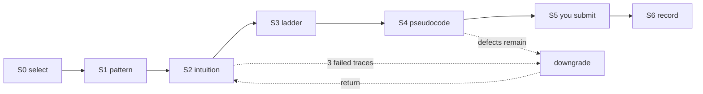

<div align="center">

# lets-dsa

**A DSA tutor that refuses to give you the answer.**

343 verified problems · 20 patterns · 8 foundation topics · 4 languages

</div>

---

## Why this exists

There is no shortage of DSA material. NeetCode 150, Striver's A2Z, Blind 75, the Grokking patterns — all good, all free or cheap, all better than anything you'd assemble yourself.

The shortage is in everything around them. Each has its own tone and pace. None knows whether you understood the last problem. So the same thing happens to almost everyone: you clear a run of Easies, feel fine, hit a Medium that assumes a jump you never made, and fall off. You have *done* sixty problems and can't solve a new one.

What's missing isn't content. It's **sequencing**, **pattern recognition**, and **proof that you actually understood** — and that last one is the hard part, because nodding is free.

This is that layer. It sits on top of curated lists it doesn't try to replace.

## The bet

> **Claude never writes the solution before you've solved it.**

Not when you ask nicely. Not when you're frustrated. Not "just the key line", not as pseudocode with the semicolons removed, not in a different language so it doesn't count.

You get five hints, each more specific than the last, then it refuses — and offers a real way out instead: it will fully solve an *easier* problem in the same pattern, front to back, then send you back to this one.

The reason is simple. Reading a solution feels like learning and isn't. The person who reads the answer to Longest Substring Without Repeating Characters cannot solve Minimum Window Substring next week. The person who derived it can.

Once you have an accepted submission the constraint lifts entirely — then it reviews your code, shows the canonical optimal, and compares them. That post-mortem is worth something precisely because you earned it.

**This is enforced, not promised.** Four MCP tools that could fetch or submit a solution are denied at the project level, so Claude *cannot* look the answer up even if it wanted to.

---

## How a problem goes



| | Stage | You can't leave until |
|---|---|---|
| **S0** | Select | — |
| **S1** | Pattern | you name the pattern **and** the signal in the constraints that selects it |
| **S2** | Intuition | you trace a small input correctly — Claude gives the input, you give the state |
| **S3** | Ladder | you give brute / better / optimal with complexities, and what optimal buys |
| **S4** | Pseudocode | your algorithm survives an adversarial input |
| **S5** | Submit | you get it accepted on leetcode.com |
| **S6** | Record | reviewed, compared, written to disk |

**No stage advances on "got it".** Only a produced artifact passes a gate — a trace, a complexity figure, a breaking input.

The gate doing the most work is **S2**. Claude hands you six characters and asks for the state after each step. You cannot fake that by nodding, and it is the cheapest way to find out whether an explanation landed.

---

## Features

### Start with the basics, not with problems

**8 foundation topics, ~16 hours, 61 free article and video links.** Complexity analysis gates *all twenty* patterns; recursion gates five. You can push past a gate — the override is recorded so your progress report stays honest.

### Theory before each pattern

A written brief for every pattern: how to recognize it from a problem *statement*, the invariant, **30 named algorithms** (Dijkstra, Kruskal, Kadane, Boyer–Moore, KMP, Sieve, Floyd's…), a traced micro-example, where it breaks, and what it gets confused with. Code-free by rule — you read them before the guardrail lifts.

### A ladder that can't skip

Patterns are topologically sorted into 6 tiers, so one never appears before its prerequisites. Inside a pattern: Easy → Medium → Hard, and at each difficulty the problem sitting in the most curated sheets comes first.

| Target | Problems | Means |
|---|---|---|
| Floor | **90** | You've met every pattern once. **Not interview-ready.** |
| Interview-ready | **180** | Realistic for product-based, weighted by what curators actually invest in |
| Strong | **250** | Comfortable rather than surviving |

### Write code the way an assessment makes you

`oa` opens a bare editor: no syntax highlighting, no autocomplete, no auto-indent, no red squiggles. Nothing is checked while you type — structurally, since the editor holds no compiler. On submit it is **really compiled and really run** in Java, C++, TypeScript or Python.

This exists because `interview` tests whether you can *talk* through a problem, and nothing tested whether you can produce correct code without an IDE. That's what breaks people in OAs and Google-Doc rounds.

### It adapts from your own history

- **Faded worked examples** (beginners only) — problem 1 in a new pattern is fully worked, problem 2 partially, problem 3 onward pure Socratic. Evidence: novices retain 20–40% more this way, and it reverses with expertise, so at intermediate/advanced it never happens.
- **Real spaced repetition** — intervals come from hints and attempts, never self-report. Clean recall grows 5→8→12→19→29 days; a lapse collapses to within a week.
- **A profile of your specific mistakes** — from your own defect tables and the patterns you misname. *"You've called sliding-window problems two-pointers four times."* No tool written for a general audience can know that.
- **Explain out loud, graded** on precision, cost-awareness and tradeoff. Solving silently is how strong coders fail interviews.

### Mock interviews and an honest verdict

`interview` runs a timed, in-persona round with escalating follow-ups and a scored rubric. `progress` gives mastery bands, your weakest patterns by blast radius, and a readiness answer that is allowed to be *no*.

---

## What accumulates

```
questions/03-sliding-window/longest-substring-without-repeating-characters.md
```

One file per problem, organized by **pattern** rather than topic — so browsing the tree is itself revision. Each holds the problem, the signal *in your words*, the invariant *in your words*, your ladder, your pseudocode, the defects found in it, your accepted code, the canonical optimal, and a note to your future self.

After a few months that folder is your own pattern library, written by you, in your language. That's the actual output. The solved count is a side effect.

---

## Setup

### What you need

| | |
|---|---|
| **Claude Code** | [claude.com/claude-code](https://claude.com/claude-code) · needs a [Claude account](https://claude.ai) (Pro or Max recommended — this is a long-running project) |
| **Python 3** | `python3 --version` |
| **git** | `git --version` |
| *Optional* | `javac`, `clang++`, `node` — only for `oa` mode (write real code, compiled and run) |

### 1. Install Claude Code

```bash
npm install -g @anthropic-ai/claude-code
```

Other install options and troubleshooting: [claude.com/claude-code](https://claude.com/claude-code)

### 2. Clone this repo

```bash
git clone https://github.com/shubhamcodess/lets-dsa.git
cd lets-dsa
```

### 3. Choose why you're here

| | **Learning DSA** | **Improving the framework** |
|---|---|---|
| `.env` | `PERSONALIZE=true` | `PERSONALIZE=false` |
| Your data | private repo of your own | none is created |
| Next step | step 4 below | step 5 below |

You can switch later. Claude reads `.env` at the start of every session and behaves accordingly.

### 4. Learning DSA — set up your private repo

Your progress, notes and profile must never land in a public repo. So you point this at a private one of your own.

**4a.** Create an **empty private repository** on GitHub. Any name — `lets-dsa-private` works.

**4b.** Wire it up:

```bash
python3 scripts/dsa-git.py init-personal --remote git@github.com:YOUR_USERNAME/lets-dsa-private.git
```

That command creates `.env` with `PERSONALIZE=true`, adds your private repo as the `personal` remote, and installs three git hooks that block a leak. It pushes nothing.

**4c.** Confirm:

```bash
python3 scripts/dsa-git.py status     # mode, remotes, identity, what's protected
python3 scripts/dsa-git.py check      # fails loudly if anything personal is on the public branch
```

**4d.** Back up your work whenever you finish something:

```bash
bash scripts/sync-vault.sh -m "solve: two-sum (#1) — accepted, 0 hints"
```

> **Using a different GitHub account for this than your machine default?** Pass `--name` and `--email` to `init-personal` and it sets a git identity for this repo only, leaving your global config alone.

### 5. Start

Open the folder in Claude Code:

```bash
claude
```

Then paste the contents of [`INIT_PROMPT.md`](INIT_PROMPT.md) as your first message.

Setup runs six verified phases — environment check, LeetCode connection test, an interview about your level and targets, then it builds the curriculum, the 8 foundation topics and your personal ladder. It reports what actually worked at each phase rather than assuming.

After that, type `basics` to begin.

### How your data stays private

Three hooks, because `.gitignore` alone is not enough:

| Layer | Stops |
|---|---|
| `.gitignore` | a normal `git add` of a personal path |
| `pre-commit` | `git add -f` followed by a commit on `main` |
| `pre-push` | pushing personal data to the public remote — **even on a renamed branch** |

Pattern briefs and animations stay public on purpose. A brief about sliding windows is about the pattern, not about you, and it's what makes this repo worth cloning. Full detail and the honest limits: [`docs/MODES.md`](docs/MODES.md).

---

## Commands

| Type | Gets you |
|---|---|
| `basics` | the 8 foundation topics |
| `today` | today's problems, sized to your real budget |
| `next` | the next problem in your track |
| `pattern <name>` | the theory brief |
| `hint` | one rung up the ladder — costs a rung, they don't reset |
| `park` · `downgrade` | save your place · an easier problem in the same pattern, fully worked |
| `solved` | review, canonical optimal, complexity comparison |
| `oa <problem>` | bare editor, real compile and run, verdict only at submit |
| `visualize <thing>` | animated explanation, saved to `visuals/` |
| `interview` | mock interview with an honest scorecard |
| `progress` | mastery per pattern and a readiness verdict |

---

## Where the content comes from

Seven curated sheets, merged by LeetCode slug into **343 unique problems** (73 Easy · 209 Medium · 61 Hard):

| Source | Problems | On LeetCode |
|---|---|---|
| [NeetCode 150](https://neetcode.io/) | 150 | 150 |
| [Striver's A2Z](https://takeuforward.org/dsa/strivers-a2z-sheet-learn-dsa-a-to-z) | 474 | 243 |
| [Striver's SDE](https://takeuforward.org/dsa/strivers-sde-sheet-top-coding-interview-problems) | 191 | 118 |
| [Blind 75](https://takeuforward.org/dsa/blind-75-leetcode-problems-detailed-video-solutions) | 75 | 66 |
| [Striver's 79](https://takeuforward.org/dsa/strivers-79-last-moment-dsa-sheet-ace-interviews) | 79 | 55 |
| [CodingShuttle CS SDE](https://www.codingshuttle.com/sheets/cs-sde-sheet/) | 169 | 169 |
| [LeetCode "Striver SDE" list](https://leetcode.com/problem-list/eeudwo2i/) | 117 | 117 |

Plus the 20-pattern taxonomy in `config/patterns.json`, and LeetCode itself via a pinned [MCP server](https://github.com/jinzcdev/leetcode-mcp-server) for live problem data.

**Sitting in several sheets is the signal.** No honest public source gives per-problem company tags, but a problem in Blind 75 *and* Striver's 79 *and* NeetCode 150 is one three independent curators thought worth your time. That drives ordering — not invented labels.

**308 problems live on GeeksforGeeks or Coding Ninjas.** They can't run the loop, which ends in a LeetCode submission, so they're kept separately with their step ordering and free article links rather than discarded.

---

## Honest limitations

- **Claude cannot verify you got Accepted.** Auth is off by default, so "solved" is what you say it is. Turn on `LEETCODE_SESSION` and it becomes a real check.
- **Company tags cover 42 of 343**, from third-party research, each with its source URL. An empty list means *not searched*, not *nobody asks it* — and the data says so.
- **OA mode can't harness every problem.** Design problems (LRU Cache style) and `ListNode`/`TreeNode` are refused explicitly rather than mis-harnessed.
- **The no-code rule is prompt-enforced.** What's mechanical is the MCP deny list, which stops Claude fetching a solution at all.
- **19 problems are LeetCode Premium.** Setup offers free substitutes.

---

## Design notes

Every file is markdown or JSON. Every change is git-committed. Nothing lives in a black box — including your progress, which is plain text you can read without this tool.

The project defaults to Sonnet. This is text-heavy teaching, not hard reasoning, and it costs a fraction of Opus to run.

**11 skills · 7 subagents · 11 scripts.** Nothing per-problem is pre-generated: the repo holds the index, and statements, briefs, harnesses and visuals are constructed when you ask for them.

See [`CLAUDE.md`](CLAUDE.md) for the operating manual and [`docs/SKILLS.md`](docs/SKILLS.md) for what each skill does.

## Contributing

Wanted, especially `ListNode`/`TreeNode` harnesses for `oa` mode (unlocks ~67 more problems) and pattern-brief improvements. One rule above all others: **never make it easier to leak a solution.** See [`CONTRIBUTING.md`](CONTRIBUTING.md).
